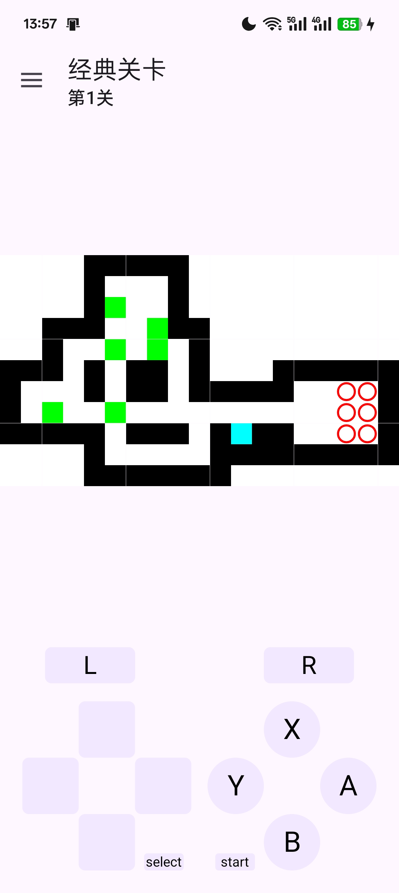
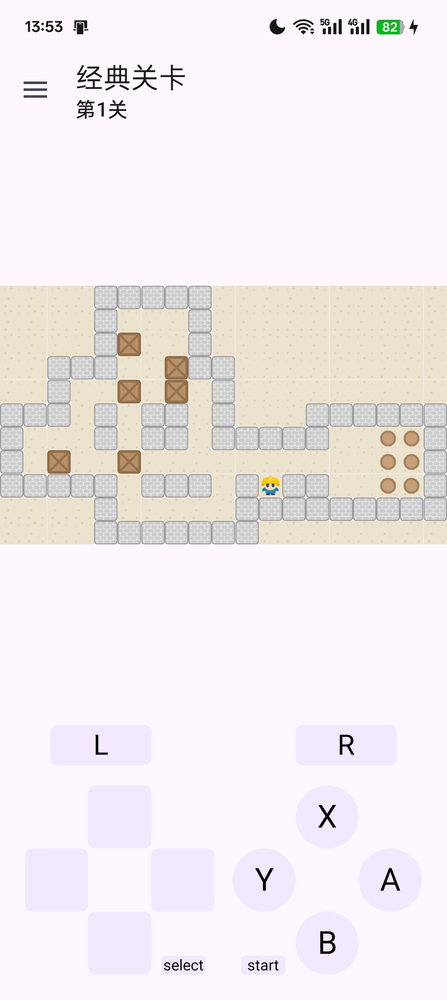
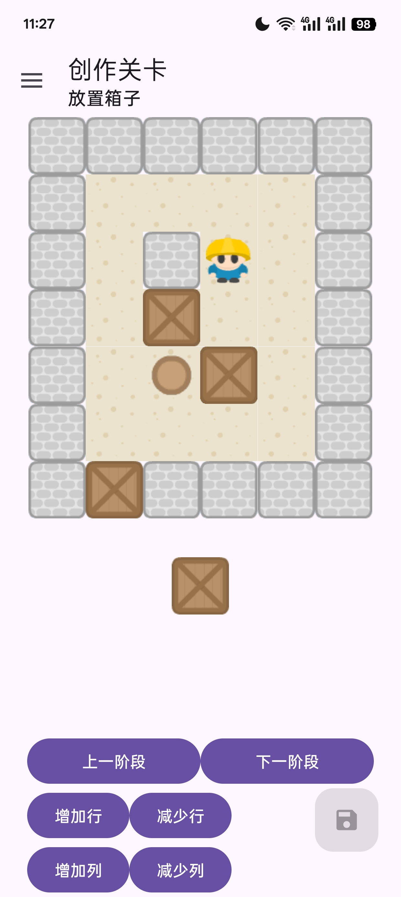
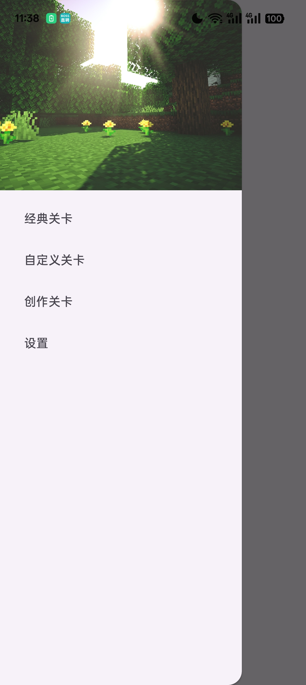
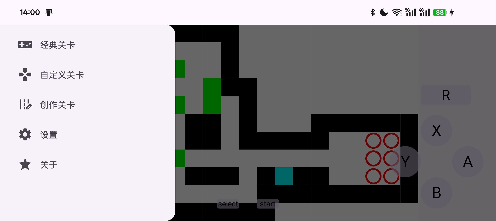
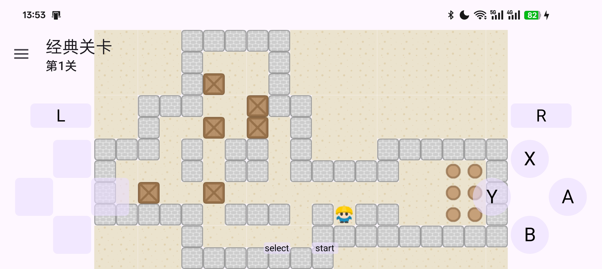

# 推箱子 Sokoban Pro（经典·创作·动画）
此readme由Grok生成模板，如有勘误请自行识别  
一个功能完整、体验优秀的经典推箱子游戏，支持**88 关内置经典关卡 + 完全自由的关卡编辑器 + 移动动画**。

*纯色皮肤示例* | *经典皮肤示例* | *编辑器界面*  
|--------------|----------------|-------------|
|  |  | 

## 核心功能

### 游戏玩法
- 内置 **88 关经典关卡**
- 每关独立存档，随时继续
- 残局一键 **刷新重玩**
- 无限 **悔一步**（Undo），再也不怕走错

### 关卡创作（重磅功能！）
- 强大的 **拖拽式关卡编辑器**
- 实时预览 + 即时试玩
- 自动保存到本地，所有自制关卡永不丢失
- 支持任意尺寸地图（最大 30×30）
- 一键导出/导入 `.levels` 文本，方便分享

### 自制关卡游玩
- 自由切换「官方关卡」和「我的创作」
- 自制关卡同样支持动画、悔步、刷新等全部功能

### 视觉与交互体验
- 支持 **横竖屏自动切换**，适配所有手机/平板
- 精致 **移动动画**（玩家与箱子平滑滑动）
- 玩家角色 **走路序列帧动画**（上下左右四方向）
- 两套内置皮肤：
  - **纯色皮肤**（极简现代风）
  - **经典皮肤**（复古像素风）
  - 在「设置」页面随时切换

## 游戏截图

| 主界面 | 游戏中（纯色皮肤）                                      | 游戏中（经典皮肤） | 关卡编辑器 |
|--------|------------------------------------------------|--------------------|------------|
|  |     |  |  |
|  |  |  |

## 安装方式

### Android
- 下载最新 APK：[Releases 页面](https://github.com/Abdulla-abs/Sokoban/releases)
- 或扫描二维码安装

### 技术栈

自定义view及逻辑相关使用Java，页面相关使用 Kotlin； Jetpack Compose
关卡文件使用标准 .levels 格式，兼容 YASS、Sokoban++ 等经典编辑器
动画系统：ValueAnimator + 浮点坐标插值，实现丝滑推箱体验
本地持久化：Room 数据库持久化自定义关卡数据 + SharedPreferences 持久化设置数据
完全离线运行，无广告、无任何权限

### 致谢

关卡数据来源于经典 YASS 88 关合集：[leoliu/sokoban](https://github.com/leoliu/sokoban)

游戏逻辑完全个人实现，无任何借鉴参考


### 源码编译
```bash
git clone https://github.com/Abdulla-abs/Sokoban.git
cd 项目目录
./gradlew assembleRelease   # 生成 app-release.apk
